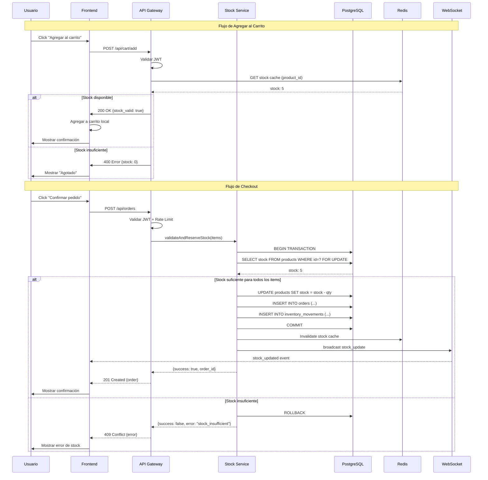
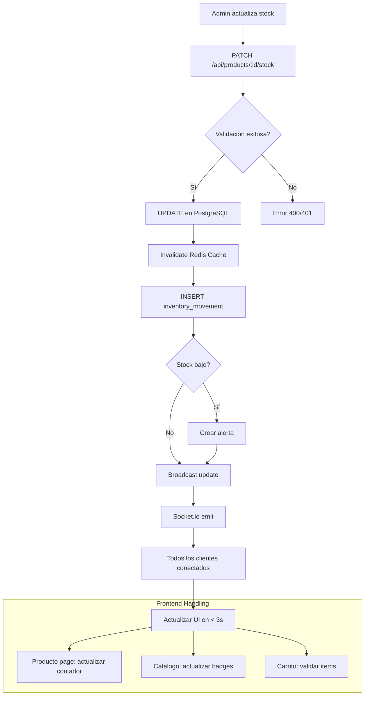

# Design Document: Sistema de Inventario Backend para DFORZZE

## Overview

El Sistema de Inventario Backend transforma la arquitectura actual de DFORZZE de una solución basada completamente en localStorage a una arquitectura cliente-servidor robusta con base de datos centralizada. El sistema previene overselling durante drops limitados, sincroniza inventario en tiempo real entre múltiples clientes, y proporciona persistencia confiable de datos mientras mantiene compatibilidad con el sistema de stickers existente.

### Decisión de Stack Tecnológico

**Backend**: Node.js + Express
- **Justificación**: Compatibilidad con el ecosistema JavaScript existente del frontend, amplio ecosistema de librerías, facilidad de contratación de desarrolladores, y excelente soporte para WebSockets.
- **Alternativas consideradas**: PHP (más difícil de integrar con el frontend vanilla JS), Firebase (menos control sobre la lógica de negocio, costos impredecibles en picos de tráfico).

**Base de Datos**: PostgreSQL
- **Justificación**: Soporte nativo para transacciones ACID (crítico para prevención de overselling), integridad referencial robusta, escalabilidad probada, y soporte para JSONB (flexibilidad para metadatos).
- **Alternativas consideradas**: MongoDB (sin transacciones ACID robustas para inventario), MySQL (menos features avanzadas que PostgreSQL).

**Sincronización en Tiempo Real**: Socket.io
- **Justificación**: Fácil integración con Express, fallbacks automáticos para navegadores antiguos, rooms para broadcasts selectivos.

**Cache**: Redis
- **Justificación**: Cache de alta velocidad para productos y stock, soporte para pub/sub (sincronización), expiración automática.

### Objetivos del Diseño

- **Cero Overselling**: Garantía absoluta de no vender más de lo disponible mediante bloqueos de fila y transacciones
- **Tiempo Real**: Actualización de stock en menos de 3 segundos para todos los clientes conectados
- **Compatibilidad**: Integración transparente con el sistema de stickers y membresía existente
- **Escalabilidad**: Soportar 50+ compras concurrentes durante drops limitados
- **Recuperación**: Backups automáticos y restauración en menos de 1 hora

## Architecture

### Arquitectura General del Sistema

```
┌─────────────────────────────────────────────────────────────────────────────┐
│                              CLIENTE (Browser)                               │
│  ┌─────────────────┐  ┌─────────────────┐  ┌─────────────────┐             │
│  │   dforzze.html  │  │   admin.html    │  │  checkout.html  │             │
│  │   (Frontend)    │  │   (Admin)       │  │   (Checkout)    │             │
│  └────────┬────────┘  └────────┬────────┘  └────────┬────────┘             │
│           │                    │                    │                       │
│           └────────────────────┼────────────────────┘                       │
│                                │                                            │
│                    ┌───────────▼───────────┐                                │
│                    │   API Client Layer    │                                │
│                    │  (api.js - nuevo)     │                                │
│                    │  - Axios/Fetch        │                                │
│                    │  - Socket.io Client   │                                │
│                    │  - Auth Interceptor   │                                │
│                    └───────────┬───────────┘                                │
└────────────────────────────────┼────────────────────────────────────────────┘
                                 │ HTTPS + WSS
                                 │
┌────────────────────────────────┼────────────────────────────────────────────┐
│                         BACKEND (Node.js + Express)                          │
│                                │                                            │
│  ┌─────────────────────────────▼─────────────────────────────┐              │
│  │                      API Gateway Layer                     │              │
│  │  - Rate Limiting (100 req/min por IP)                     │              │
│  │  - CORS Configuration                                     │              │
│  │  - Request Validation                                     │              │
│  │  - Error Handling Middleware                              │              │
│  └─────────────────────────────┬─────────────────────────────┘              │
│                                │                                            │
│  ┌─────────────────────────────▼─────────────────────────────┐              │
│  │                   Authentication Layer                     │              │
│  │  - JWT Validation                                         │              │
│  │  - Role-based Access Control (USER, ADMIN)                │              │
│  │  - Token Refresh                                          │              │
│  └─────────────────────────────┬─────────────────────────────┘              │
│                                │                                            │
│  ┌─────────────────────────────▼─────────────────────────────┐              │
│  │                    Business Logic Layer                    │              │
│  │  ┌─────────────┐  ┌─────────────┐  ┌─────────────┐       │              │
│  │  │  Producto   │  │  Inventario │  │   Pedido    │       │              │
│  │  │  Service    │  │  Service    │  │  Service    │       │              │
│  │  └─────────────┘  └─────────────┘  └─────────────┘       │              │
│  │  ┌─────────────┐  ┌─────────────┐  ┌─────────────┐       │              │
│  │  │  Usuario    │  │  Stickers   │  │   Alertas   │       │              │
│  │  │  Service    │  │  Service    │  │  Service    │       │              │
│  │  └─────────────┘  └─────────────┘  └─────────────┘       │              │
│  └─────────────────────────────┬─────────────────────────────┘              │
│                                │                                            │
│  ┌─────────────────────────────▼─────────────────────────────┐              │
│  │                   Real-time Layer (Socket.io)              │              │
│  │  - Stock Updates Broadcasting                             │              │
│  │  - Order Confirmation Events                              │              │
│  │  - Admin Notifications                                    │              │
│  └─────────────────────────────┬─────────────────────────────┘              │
│                                │                                            │
│  ┌─────────────────────────────▼─────────────────────────────┐              │
│  │                     Data Access Layer                      │              │
│  │  - PostgreSQL (Primary Database)                          │              │
│  │  - Redis (Cache + Session Store)                          │              │
│  │  - Connection Pooling                                     │              │
│  └─────────────────────────────┬─────────────────────────────┘              │
└────────────────────────────────┼────────────────────────────────────────────┘
                                 │
                    ┌────────────▼────────────┐
                    │      PostgreSQL DB      │
                    │  - Products             │
                    │  - Users                │
                    │  - Orders               │
                    │  - Inventory Movements  │
                    │  - Stickers             │
                    └─────────────────────────┘
                                 │
                    ┌────────────▼────────────┐
                    │        Redis Cache      │
                    │  - Product Stock        │
                    │  - User Sessions        │
                    │  - Rate Limit Counters  │
                    └─────────────────────────┘
```

### Diagrama de Flujo: Proceso de Compra con Validación de Stock



### Diagrama de Flujo: Sincronización en Tiempo Real



## Components and Interfaces

### 1. API RESTful - Endpoints

#### Autenticación

```yaml
POST /api/auth/register
  Description: Registrar nuevo usuario
  Request Body:
    {
      "name": "string (required, 2-100 chars)",
      "email": "string (required, email format)",
      "password": "string (required, 8-100 chars, must include: uppercase, lowercase, number)"
    }
  Response 201:
    {
      "success": true,
      "data": {
        "user": { "id": "uuid", "name": "...", "email": "...", "rank": "NONE" },
        "token": "jwt_token",
        "refreshToken": "jwt_refresh_token"
      }
    }
  Response 400: { "success": false, "error": "Validation error details" }
  Response 409: { "success": false, "error": "Email already registered" }

POST /api/auth/login
  Description: Iniciar sesión
  Request Body:
    {
      "email": "string (required)",
      "password": "string (required)"
    }
  Response 200:
    {
      "success": true,
      "data": {
        "user": { "id": "uuid", "name": "...", "email": "...", "rank": "...", "stickerCount": 0 },
        "token": "jwt_token",
        "refreshToken": "jwt_refresh_token"
      }
    }
  Response 401: { "success": false, "error": "Invalid credentials" }

POST /api/auth/refresh
  Description: Renovar token de acceso
  Request Body: { "refreshToken": "string" }
  Response 200: { "success": true, "data": { "token": "new_jwt_token" } }

POST /api/auth/logout
  Description: Cerrar sesión (revocar token)
  Headers: Authorization: Bearer {token}
  Response 200: { "success": true }
```

#### Productos e Inventario

```yaml
GET /api/products
  Description: Listar productos con stock
  Query Params:
    - category: string (optional) - Filtrar por categoría
    - status: string (optional) - "available" | "low" | "out_of_stock"
    - page: number (default: 1)
    - limit: number (default: 50, max: 100)
  Response 200:
    {
      "success": true,
      "data": {
        "products": [
          {
            "id": "uuid",
            "name": "DFORZZE SHORT 01",
            "description": "...",
            "price": 80.00,
            "category": "Pantalones",
            "stock": 15,
            "lowStockThreshold": 5,
            "images": ["images/1.png"],
            "status": "available",
            "createdAt": "2024-01-15T10:00:00Z",
            "updatedAt": "2024-01-20T14:30:00Z"
          }
        ],
        "pagination": {
          "page": 1,
          "limit": 50,
          "total": 5,
          "totalPages": 1
        }
      }
    }

GET /api/products/:id
  Description: Obtener detalles de un producto
  Response 200:
    {
      "success": true,
      "data": {
        "id": "uuid",
        "name": "DFORZZE SHORT 01",
        "description": "...",
        "price": 80.00,
        "category": "Pantalones",
        "stock": 15,
        "lowStockThreshold": 5,
        "images": ["images/1.png"],
        "movements": [
          {
            "id": "uuid",
            "type": "purchase",
            "quantity": -1,
            "previousStock": 16,
            "newStock": 15,
            "orderId": "uuid",
            "createdAt": "2024-01-20T14:30:00Z"
          }
        ]
      }
    }
  Response 404: { "success": false, "error": "Product not found" }

PATCH /api/products/:id/stock
  Description: Actualizar stock de un producto (solo administradores)
  Headers: Authorization: Bearer {token}
  Request Body:
    {
      "stock": "number (required, >= 0)",
      "reason": "string (required) - 'restock' | 'adjustment' | 'return' | 'damage'"
    }
  Response 200:
    {
      "success": true,
      "data": {
        "product": { "id": "uuid", "stock": 20, ... },
        "movement": {
          "id": "uuid",
          "type": "adjustment",
          "quantity": 5,
          "previousStock": 15,
          "newStock": 20
        }
      }
    }
  Response 400: { "success": false, "error": "Invalid stock value" }
  Response 401: { "success": false, "error": "Unauthorized" }
  Response 403: { "success": false, "error": "Admin access required" }

POST /api/products
  Description: Crear nuevo producto (solo administradores)
  Headers: Authorization: Bearer {token}
  Request Body:
    {
      "name": "string (required, unique)",
      "description": "string (optional)",
      "price": "number (required, > 0)",
      "category": "string (required)",
      "stock": "number (required, >= 0)",
      "lowStockThreshold": "number (default: 5)",
      "images": ["string"] (optional)
    }
  Response 201: { "success": true, "data": { "product": {...} } }

DELETE /api/products/:id
  Description: Eliminar producto (solo administradores)
  Headers: Authorization: Bearer {token}
  Response 200: { "success": true, "data": { "deleted": true } }
  Response 404: { "success": false, "error": "Product not found" }
```

#### Pedidos

```yaml
POST /api/orders
  Description: Crear nuevo pedido
  Headers: Authorization: Bearer {token}
  Request Body:
    {
      "items": [
        {
          "productId": "uuid",
          "quantity": "number (>= 1)"
        }
      ],
      "shipping": {
        "name": "string",
        "email": "string",
        "phone": "string",
        "address": "string",
        "city": "string",
        "district": "string",
        "zip": "string",
        "country": "string"
      },
      "shippingMethod": "standard" | "express",
      "couponCode": "string (optional)"
    }
  Response 201:
    {
      "success": true,
      "data": {
        "order": {
          "id": "uuid",
          "status": "pending",
          "items": [...],
          "subtotal": 160.00,
          "discount": 16.00,
          "shipping": 10.00,
          "total": 154.00,
          "stickersEarned": 2,
          "createdAt": "2024-01-20T15:00:00Z"
        }
      }
    }
  Response 400: { "success": false, "error": "Invalid order data" }
  Response 409: { "success": false, "error": "Insufficient stock", "data": { "items": [...] } }

GET /api/orders
  Description: Listar pedidos del usuario (o todos si es admin)
  Headers: Authorization: Bearer {token}
  Query Params:
    - status: string (optional) - "pending" | "processing" | "shipped" | "delivered"
    - page: number
    - limit: number
  Response 200: { "success": true, "data": { "orders": [...] } }

GET /api/orders/:id
  Description: Obtener detalles de un pedido
  Headers: Authorization: Bearer {token}
  Response 200: { "success": true, "data": { "order": {...} } }
```

#### Inventario (Admin)

```yaml
GET /api/inventory/movements
  Description: Historial de movimientos de inventario
  Headers: Authorization: Bearer {token}
  Query Params:
    - productId: uuid (optional)
    - type: string (optional) - "purchase" | "adjustment" | "return" | "restock" | "damage"
    - startDate: date (optional)
    - endDate: date (optional)
    - page: number
    - limit: number
  Response 200:
    {
      "success": true,
      "data": {
        "movements": [
          {
            "id": "uuid",
            "productId": "uuid",
            "productName": "DFORZZE SHORT 01",
            "type": "purchase",
            "quantity": -1,
            "previousStock": 16,
            "newStock": 15,
            "orderId": "uuid",
            "userId": "uuid",
            "userName": "Admin",
            "reason": "Venta confirmada",
            "createdAt": "2024-01-20T14:30:00Z"
          }
        ],
        "pagination": {...}
      }
    }

GET /api/inventory/alerts
  Description: Alertas de stock bajo
  Headers: Authorization: Bearer {token}
  Response 200:
    {
      "success": true,
      "data": {
        "alerts": [
          {
            "id": "uuid",
            "productId": "uuid",
            "productName": "DFORZZE TEE SAKURA",
            "currentStock": 2,
            "threshold": 5,
            "createdAt": "2024-01-19T10:00:00Z",
            "acknowledged": false
          }
        ],
        "summary": {
          "total": 3,
          "critical": 1,
          "warning": 2
        }
      }
    }

PATCH /api/inventory/alerts/:id/acknowledge
  Description: Marcar alerta como reconocida
  Headers: Authorization: Bearer {token}
  Response 200: { "success": true }

GET /api/inventory/export
  Description: Exportar historial a CSV
  Headers: Authorization: Bearer {token}
  Response 200: text/csv (attachment)
```

#### Stickers

```yaml
GET /api/stickers/my-collection
  Description: Obtener stickers del usuario autenticado
  Headers: Authorization: Bearer {token}
  Response 200:
    {
      "success": true,
      "data": {
        "stickers": [
          {
            "id": "uuid",
            "name": "Sakura — Colección 01",
            "emoji": "🌸",
            "drop": "Colección 01",
            "pts": 1,
            "type": "drop",
            "orderId": "uuid",
            "redeemedAt": "2024-01-20T15:00:00Z"
          }
        ],
        "totalCount": 5,
        "rank": "INITIATED",
        "nextRank": "BUILDER",
        "progressToNextRank": 0.71
      }
    }

POST /api/stickers/redeem
  Description: Canjear código de sticker
  Headers: Authorization: Bearer {token}
  Request Body: { "code": "string" }
  Response 200:
    {
      "success": true,
      "data": {
        "sticker": {
          "name": "Sakura — Colección 01",
          "emoji": "🌸",
          "pts": 1
        },
        "newTotal": 6,
        "rankProgress": { ... }
      }
    }
  Response 400: { "success": false, "error": "Invalid or expired code" }

POST /api/stickers/generate-code
  Description: Generar código de sticker (solo admin)
  Headers: Authorization: Bearer {token}
  Request Body:
    {
      "type": "sticker",
      "dropName": "Colección 01",
      "quantity": 1
    }
  Response 201:
    {
      "success": true,
      "data": {
        "codes": [
          { "code": "DFZ-SAK-XXXXX", "type": "sticker", "active": true }
        ]
      }
    }
```

### 2. Componentes del Backend

#### Estructura de Carpetas

```
dforzze-backend/
├── src/
│   ├── config/
│   │   ├── database.js        # PostgreSQL connection pool
│   │   ├── redis.js           # Redis client
│   │   ├── socket.js          # Socket.io configuration
│   │   └── environment.js     # Env variables
│   │
│   ├── middleware/
│   │   ├── auth.js            # JWT validation
│   │   ├── rateLimiter.js     # Rate limiting
│   │   ├── validator.js       # Request validation
│   │   ├── errorHandler.js    # Global error handler
│   │   └── adminOnly.js       # Admin role check
│   │
│   ├── models/
│   │   ├── User.js
│   │   ├── Product.js
│   │   ├── Order.js
│   │   ├── InventoryMovement.js
│   │   ├── Sticker.js
│   │   └── Alert.js
│   │
│   ├── services/
│   │   ├── AuthService.js
│   │   ├── ProductService.js
│   │   ├── InventoryService.js
│   │   ├── OrderService.js
│   │   ├── StickerService.js
│   │   ├── AlertService.js
│   │   └── CacheService.js
│   │
│   ├── controllers/
│   │   ├── AuthController.js
│   │   ├── ProductController.js
│   │   ├── OrderController.js
│   │   ├── InventoryController.js
│   │   └── StickerController.js
│   │
│   ├── routes/
│   │   ├── index.js           # Route aggregator
│   │   ├── auth.routes.js
│   │   ├── products.routes.js
│   │   ├── orders.routes.js
│   │   ├── inventory.routes.js
│   │   └── stickers.routes.js
│   │
│   ├── websocket/
│   │   ├── handlers/
│   │   │   ├── stock.handler.js
│   │   │   └── order.handler.js
│   │   └── events.js
│   │
│   ├── utils/
│   │   ├── logger.js
│   │   ├── hash.js            # bcrypt utilities
│   │   ├── jwt.js             # JWT utilities
│   │   └── validators.js      # Joi/Yup schemas
│   │
│   └── app.js                 # Express app setup
│
├── prisma/
│   └── schema.prisma          # Database schema
│
├── tests/
│   ├── unit/
│   ├── integration/
│   └── property/              # Property-based tests
│
├── scripts/
│   ├── seed.js                # Initial data
│   ├── migrate-localstorage.js # Migration script
│   └── backup.js              # Backup utility
│
├── .env.example
├── package.json
└── README.md
```

#### Servicio de Inventario (InventoryService.js)

```javascript
// src/services/InventoryService.js

const { PrismaClient } = require('@prisma/client');
const prisma = new PrismaClient();
const redis = require('../config/redis');
const { broadcastStockUpdate } = require('../websocket/events');

class InventoryService {
  /**
   * Valida y reserva stock en una transacción atómica.
   * Usa SELECT FOR UPDATE para prevenir race conditions.
   * 
   * @param {Array} items - Array de { productId, quantity }
   * @returns {Object} - { success, reservedItems, errors }
   */
  async validateAndReserveStock(items, orderId, userId) {
    return await prisma.$transaction(async (tx) => {
      const reservedItems = [];
      const errors = [];
      
      // Ordenar items para prevenir deadlocks
      const sortedItems = [...items].sort((a, b) => 
        a.productId.localeCompare(b.productId)
      );
      
      for (const item of sortedItems) {
        // SELECT FOR UPDATE bloquea la fila
        const product = await tx.$queryRaw`
          SELECT id, name, stock, price 
          FROM products 
          WHERE id = ${item.productId} 
          FOR UPDATE
        `;
        
        if (!product || product.length === 0) {
          errors.push({
            productId: item.productId,
            error: 'Product not found'
          });
          continue;
        }
        
        const p = product[0];
        
        if (p.stock < item.quantity) {
          errors.push({
            productId: item.productId,
            productName: p.name,
            available: p.stock,
            requested: item.quantity,
            error: 'Insufficient stock'
          });
          continue;
        }
        
        // Actualizar stock
        await tx.$executeRaw`
          UPDATE products 
          SET stock = stock - ${item.quantity}, 
              updated_at = NOW()
          WHERE id = ${item.productId}
        `;
        
        // Registrar movimiento
        await tx.inventoryMovement.create({
          data: {
            productId: item.productId,
            type: 'purchase',
            quantity: -item.quantity,
            previousStock: p.stock,
            newStock: p.stock - item.quantity,
            orderId,
            userId,
            reason: 'Venta confirmada'
          }
        });
        
        reservedItems.push({
          productId: item.productId,
          productName: p.name,
          quantity: item.quantity,
          price: p.price,
          newStock: p.stock - item.quantity
        });
      }
      
      if (errors.length > 0) {
        // Rollback automático al lanzar error
        throw new Error(JSON.stringify({ errors, type: 'stock_error' }));
      }
      
      // Invalidar cache después de commit
      for (const item of reservedItems) {
        await this.invalidateStockCache(item.productId);
      }
      
      return { success: true, reservedItems };
    }, {
      maxWait: 5000,  // Máximo 5s esperando lock
      timeout: 10000  // Timeout total 10s
    });
  }
  
  /**
   * Invalida el cache de stock en Redis
   */
  async invalidateStockCache(productId) {
    await redis.del(`stock:${productId}`);
    await redis.del('products:all');
    
    // Broadcast update via WebSocket
    broadcastStockUpdate(productId);
  }
  
  /**
   * Obtiene stock actual con cache
   */
  async getStock(productId) {
    // Intentar obtener de cache primero
    const cached = await redis.get(`stock:${productId}`);
    if (cached !== null) {
      return parseInt(cached, 10);
    }
    
    // Si no está en cache, obtener de DB
    const product = await prisma.product.findUnique({
      where: { id: productId },
      select: { stock: true }
    });
    
    if (!product) {
      throw new Error('Product not found');
    }
    
    // Guardar en cache por 60 segundos
    await redis.setex(`stock:${productId}`, 60, product.stock);
    
    return product.stock;
  }
  
  /**
   * Actualiza stock manualmente (admin)
   */
  async updateStock(productId, newStock, reason, userId) {
    const product = await prisma.product.findUnique({
      where: { id: productId }
    });
    
    if (!product) {
      throw new Error('Product not found');
    }
    
    const previousStock = product.stock;
    const quantity = newStock - previousStock;
    
    const result = await prisma.$transaction([
      prisma.product.update({
        where: { id: productId },
        data: { 
          stock: newStock,
          updatedAt: new Date()
        }
      }),
      prisma.inventoryMovement.create({
        data: {
          productId,
          type: 'adjustment',
          quantity,
          previousStock,
          newStock,
          userId,
          reason
        }
      })
    ]);
    
    // Invalidar cache y broadcast
    await this.invalidateStockCache(productId);
    
    // Verificar si genera alerta
    if (newStock <= product.lowStockThreshold && previousStock > product.lowStockThreshold) {
      await this.createLowStockAlert(productId, newStock);
    }
    
    return result;
  }
  
  /**
   * Crea alerta de stock bajo
   */
  async createLowStockAlert(productId, currentStock) {
    const product = await prisma.product.findUnique({
      where: { id: productId }
    });
    
    return await prisma.alert.create({
      data: {
        productId,
        type: 'low_stock',
        message: `${product.name} tiene ${currentStock} unidades (umbral: ${product.lowStockThreshold})`,
        metadata: {
          currentStock,
          threshold: product.lowStockThreshold
        }
      }
    });
  }
}

module.exports = new InventoryService();
```

#### Servicio de Pedidos (OrderService.js)

```javascript
// src/services/OrderService.js

const { PrismaClient } = require('@prisma/client');
const prisma = new PrismaClient();
const inventoryService = require('./InventoryService');
const stickerService = require('./StickerService');

class OrderService {
  /**
   * Crea un pedido con validación de stock atómica
   */
  async createOrder(userId, orderData) {
    const { items, shipping, shippingMethod, couponCode } = orderData;
    
    // 1. Calcular totales
    const productIds = items.map(i => i.productId);
    const products = await prisma.product.findMany({
      where: { id: { in: productIds } }
    });
    
    const productMap = new Map(products.map(p => [p.id, p]));
    
    let subtotal = 0;
    for (const item of items) {
      const product = productMap.get(item.productId);
      if (!product) {
        throw new Error(`Product ${item.productId} not found`);
      }
      item.price = product.price;
      subtotal += product.price * item.quantity;
    }
    
    // 2. Aplicar cupón si existe
    let discount = 0;
    if (couponCode) {
      const coupon = await this.validateCoupon(couponCode);
      if (coupon.valid) {
        discount = Math.round(subtotal * coupon.percentage / 100);
      }
    }
    
    // 3. Calcular envío
    const shippingCost = shippingMethod === 'express' ? 20 : 10;
    const total = subtotal - discount + shippingCost;
    
    // 4. Crear pedido y reservar stock en transacción
    const order = await prisma.$transaction(async (tx) => {
      // Crear el pedido primero para obtener ID
      const newOrder = await tx.order.create({
        data: {
          userId,
          status: 'pending',
          subtotal,
          discount,
          shippingCost,
          total,
          shippingMethod,
          shippingName: shipping.name,
          shippingEmail: shipping.email,
          shippingPhone: shipping.phone,
          shippingAddress: shipping.address,
          shippingCity: shipping.city,
          shippingDistrict: shipping.district,
          shippingZip: shipping.zip,
          shippingCountry: shipping.country,
          items: {
            create: items.map(item => ({
              productId: item.productId,
              quantity: item.quantity,
              price: item.price
            }))
          }
        }
      });
      
      // Reservar stock con bloqueo
      const result = await inventoryService.validateAndReserveStock(
        items,
        newOrder.id,
        userId
      );
      
      return newOrder;
    });
    
    // 5. Asignar stickers según monto
    const stickersEarned = this.calculateStickers(total);
    if (stickersEarned > 0) {
      await stickerService.assignStickers(userId, stickersEarned, order.id);
    }
    
    // 6. Obtener pedido completo
    const completeOrder = await prisma.order.findUnique({
      where: { id: order.id },
      include: {
        items: {
          include: { product: true }
        }
      }
    });
    
    return {
      ...completeOrder,
      stickersEarned
    };
  }
  
  /**
   * Calcula stickers según monto de compra
   * S/. 100+ = 1 | S/. 200+ = 2 | S/. 400+ = 3
   */
  calculateStickers(total) {
    if (total >= 400) return 3;
    if (total >= 200) return 2;
    if (total >= 100) return 1;
    return 0;
  }
  
  /**
   * Valida cupón de descuento
   */
  async validateCoupon(code) {
    const coupon = await prisma.coupon.findUnique({
      where: { code }
    });
    
    if (!coupon) {
      return { valid: false, error: 'Invalid coupon' };
    }
    
    if (!coupon.active) {
      return { valid: false, error: 'Coupon already used' };
    }
    
    return { valid: true, percentage: coupon.percentage };
  }
}

module.exports = new OrderService();
```

### 3. Componentes del Frontend

#### API Client Layer (api.js)

```javascript
// public/js/api.js

const API_BASE_URL = window.location.hostname === 'localhost' 
  ? 'http://localhost:3000/api' 
  : 'https://api.dforzze.com/api';

class DforzzeAPI {
  constructor() {
    this.token = localStorage.getItem('dforzze_token');
    this.refreshToken = localStorage.getItem('dforzze_refresh_token');
    this.socket = null;
  }
  
  // Configurar headers
  getHeaders() {
    const headers = {
      'Content-Type': '{}
'application/json'
    };
    if (this.token) {
      headers['Authorization'] = `Bearer ${this.token}`;
    }
    return headers;
  }
  
  // Manejar respuesta
  async handleResponse(response) {
    const data = await response.json();
    
    if (!response.ok) {
      // Si es 401, intentar refresh token
      if (response.status === 401 && this.refreshToken) {
        const refreshed = await this.refreshAccessToken();
        if (refreshed) {
          // Reintentar la petición original
          return this.request(response.url, response.init);
        }
      }
      throw new Error(data.error || 'Request failed');
    }
    
    return data;
  }
  
  // Refresh token
  async refreshAccessToken() {
    try {
      const response = await fetch(`${API_BASE_URL}/auth/refresh`, {
        method: 'POST',
        headers: { 'Content-Type': 'application/json' },
        body: JSON.stringify({ refreshToken: this.refreshToken })
      });
      
      const data = await response.json();
      
      if (data.success) {
        this.token = data.data.token;
        localStorage.setItem('dforzze_token', this.token);
        return true;
      }
    } catch (e) {
      console.error('Token refresh failed:', e);
    }
    
    // Logout si falla refresh
    this.logout();
    return false;
  }
  
  // Logout
  logout() {
    this.token = null;
    this.refreshToken = null;
    localStorage.removeItem('dforzze_token');
    localStorage.removeItem('dforzze_refresh_token');
    localStorage.removeItem('dforzze_user');
    window.location.href = 'dforzze.html';
  }
  
  // Request genérico
  async request(url, options = {}) {
    const response = await fetch(url, {
      ...options,
      headers: this.getHeaders()
    });
    return this.handleResponse(response);
  }
  
  // ==================== AUTH ====================
  
  async register(name, email, password) {
    const data = await this.request(`${API_BASE_URL}/auth/register`, {
      method: 'POST',
      body: JSON.stringify({ name, email, password })
    });
    
    if (data.success) {
      this.token = data.data.token;
      this.refreshToken = data.data.refreshToken;
      localStorage.setItem('dforzze_token', this.token);
      localStorage.setItem('dforzze_refresh_token', this.refreshToken);
      localStorage.setItem('dforzze_user', JSON.stringify(data.data.user));
    }
    
    return data;
  }
  
  async login(email, password) {
    const data = await this.request(`${API_BASE_URL}/auth/login`, {
      method: 'POST',
      body: JSON.stringify({ email, password })
    });
    
    if (data.success) {
      this.token = data.data.token;
      this.refreshToken = data.data.refreshToken;
      localStorage.setItem('dforzze_token', this.token);
      localStorage.setItem('dforzze_refresh_token', this.refreshToken);
      localStorage.setItem('dforzze_user', JSON.stringify(data.data.user));
    }
    
    return data;
  }
  
  // ==================== PRODUCTS ====================
  
  async getProducts(params = {}) {
    const query = new URLSearchParams(params).toString();
    return this.request(`${API_BASE_URL}/products?${query}`);
  }
  
  async getProduct(id) {
    return this.request(`${API_BASE_URL}/products/${id}`);
  }
  
  async updateStock(productId, stock, reason) {
    return this.request(`${API_BASE_URL}/products/${productId}/stock`, {
      method: 'PATCH',
      body: JSON.stringify({ stock, reason })
    });
  }
  
  // ==================== ORDERS ====================
  
  async createOrder(orderData) {
    return this.request(`${API_BASE_URL}/orders`, {
      method: 'POST',
      body: JSON.stringify(orderData)
    });
  }
  
  async getOrders(params = {}) {
    const query = new URLSearchParams(params).toString();
    return this.request(`${API_BASE_URL}/orders?${query}`);
  }
  
  // ==================== INVENTORY ====================
  
  async getInventoryMovements(params = {}) {
    const query = new URLSearchParams(params).toString();
    return this.request(`${API_BASE_URL}/inventory/movements?${query}`);
  }
  
  async getAlerts() {
    return this.request(`${API_BASE_URL}/inventory/alerts`);
  }
  
  // ==================== STICKERS ====================
  
  async getMyStickers() {
    return this.request(`${API_BASE_URL}/stickers/my-collection`);
  }
  
  async redeemStickerCode(code) {
    return this.request(`${API_BASE_URL}/stickers/redeem`, {
      method: 'POST',
      body: JSON.stringify({ code })
    });
  }
  
  // ==================== WEBSOCKET ====================
  
  connectWebSocket() {
    if (this.socket) return;
    
    const socketUrl = API_BASE_URL.replace('/api', '').replace('http', 'ws');
    this.socket = io(socketUrl, {
      auth: { token: this.token }
    });
    
    this.socket.on('connect', () => {
      console.log('WebSocket connected');
    });
    
    this.socket.on('stock_update', (data) => {
      // Disparar evento custom para que los componentes escuchen
      window.dispatchEvent(new CustomEvent('dforzze:stock_update', { 
        detail: data 
      }));
    });
    
    this.socket.on('order_update', (data) => {
      window.dispatchEvent(new CustomEvent('dforzze:order_update', { 
        detail: data 
      }));
    });
    
    this.socket.on('disconnect', () => {
      console.log('WebSocket disconnected');
    });
  }
  
  disconnectWebSocket() {
    if (this.socket) {
      this.socket.disconnect();
      this.socket = null;
    }
  }
}

// Singleton instance
window.dforzzeAPI = new DforzzeAPI();
```

#### Integración en checkout.html

```javascript
// Modificación en checkout.html - Función placeOrder()

async function placeOrder() {
  const cart = JSON.parse(localStorage.getItem('dforzzeCart') || '[]');
  
  if (cart.length === 0) {
    alert('El carrito está vacío');
    return;
  }
  
  // Preparar datos del pedido
  const orderData = {
    items: cart.map(item => ({
      productId: item.id,
      quantity: item.qty
    })),
    shipping: {
      name: `${document.getElementById('fname').value} ${document.getElementById('lname').value}`,
      email: document.getElementById('email').value,
      phone: document.getElementById('phone').value,
      address: document.getElementById('address').value,
      city: document.getElementById('city').value,
      district: document.getElementById('district').value,
      zip: document.getElementById('zip').value,
      country: document.getElementById('country').value
    },
    shippingMethod: document.querySelector('input[name="shipping"]:checked').value,
    couponCode: document.getElementById('couponInput').value || null
  };
  
  try {
    // Llamar API en lugar de guardar en localStorage
    const result = await dforzzeAPI.createOrder(orderData);
    
    if (result.success) {
      // Limpiar carrito
      localStorage.removeItem('dforzzeCart');
      
      // Mostrar confirmación con stickers ganados
      showOrderConfirmation(result.data);
    }
  } catch (error) {
    // Manejar error de stock
    if (error.message.includes('Insufficient stock')) {
      alert('Lo sentimos, algunos productos ya no tienen stock disponible. Por favor actualiza tu carrito.');
      // Mostrar qué items tienen problema
    } else {
      alert('Error al procesar el pedido: ' + error.message);
    }
  }
}

function showOrderConfirmation(order) {
  // Actualizar UI con datos del pedido
  document.getElementById('step1').style.display = 'none';
  document.getElementById('step2').style.display = 'none';
  document.getElementById('step3').style.display = 'none';
  document.getElementById('step4').style.display = 'block';
  
  // Mostrar stickers ganados
  const rewardDiv = document.getElementById('stickerReward');
  if (order.stickersEarned > 0) {
    rewardDiv.innerHTML = `
      <div style="margin-bottom:14px">
        <p style="font-weight:800;font-size:15px;color:#000;margin-bottom:3px">
          🌸 +${order.stickersEarned} sticker${order.stickersEarned > 1 ? 's' : ''} ganado${order.stickersEarned > 1 ? 's' : ''} — Colección 01
        </p>
        <p style="font-size:12px;color:rgba(0,0,0,.45)">Se sumaron a tu colección del Members Club.</p>
      </div>
    `;
  }
}
```

## Data Models

### Schema de Base de Datos (Prisma)

```prisma
// prisma/schema.prisma

generator client {
  provider = "prisma-client-js"
}

datasource db {
  provider = "postgresql"
  url      = env("DATABASE_URL")
}

model User {
  id            String    @id @default(uuid())
  name          String
  email         String    @unique
  passwordHash  String
  role          Role      @default(USER)
  rank          Rank      @default(NONE)
  stickerCount  Int       @default(0)
  blocked       Boolean   @default(false)
  image         String?
  createdAt     DateTime  @default(now())
  updatedAt     DateTime  @updatedAt
  
  orders        Order[]
  stickers      Sticker[]
  codes         Coupon[]
  movements     InventoryMovement[]
  rankRequests  RankRequest[]
  
  @@index([email])
  @@index([rank])
}

model Product {
  id                String    @id @default(uuid())
  name              String    @unique
  description       String?
  price             Decimal   @db.Decimal(10, 2)
  category          String
  stock             Int       @default(0)
  lowStockThreshold Int       @default(5)
  images            String[]
  active            Boolean   @default(true)
  createdAt         DateTime  @default(now())
  updatedAt         DateTime  @updatedAt
  
  orderItems        OrderItem[]
  movements         InventoryMovement[]
  alerts            Alert[]
  
  @@index([category])
  @@index([stock])
}

model Order {
  id              String    @id @default(uuid())
  userId          String
  status          OrderStatus @default(pending)
  subtotal        Decimal   @db.Decimal(10, 2)
  discount        Decimal   @default(0) @db.Decimal(10, 2)
  shippingCost    Decimal   @db.Decimal(10, 2)
  total           Decimal   @db.Decimal(10, 2)
  shippingMethod  String
  shippingName    String
  shippingEmail   String
  shippingPhone   String
  shippingAddress String
  shippingCity    String
  shippingDistrict String
  shippingZip     String
  shippingCountry String
  createdAt       DateTime  @default(now())
  updatedAt       DateTime  @updatedAt
  
  user            User      @relation(fields: [userId], references: [id])
  items           OrderItem[]
  movements       InventoryMovement[]
  stickers        Sticker[]
  
  @@index([userId])
  @@index([status])
  @@index([createdAt])
}

model OrderItem {
  id          String   @id @default(uuid())
  orderId     String
  productId   String
  quantity    Int
  price       Decimal  @db.Decimal(10, 2)
  
  order       Order    @relation(fields: [orderId], references: [id], onDelete: Cascade)
  product     Product  @relation(fields: [productId], references: [id])
  
  @@index([orderId])
  @@index([productId])
}

model InventoryMovement {
  id            String   @id @default(uuid())
  productId     String
  type          MovementType
  quantity      Int
  previousStock Int
  newStock      Int
  orderId       String?
  userId        String?
  reason        String?
  createdAt     DateTime @default(now())
  
  product       Product  @relation(fields: [productId], references: [id])
  order         Order?   @relation(fields: [orderId], references: [id])
  user          User?    @relation(fields: [userId], references: [id])
  
  @@index([productId])
  @@index([type])
  @@index([createdAt])
}

model Sticker {
  id          String   @id @default(uuid())
  userId      String
  orderId     String?
  name        String
  emoji       String
  drop        String
  pts         Int      @default(1)
  type        String   @default("drop")  // "drop" | "code" | "admin"
  redeemedAt  DateTime @default(now())
  
  user        User     @relation(fields: [userId], references: [id])
  order       Order?   @relation(fields: [orderId], references: [id])
  
  @@index([userId])
  @@index([drop])
}

model Coupon {
  id          String   @id @default(uuid())
  code        String   @unique
  type        String   // "discount" | "sticker"
  value       String
  percentage  Int?
  active      Boolean  @default(true)
  usedBy      String?
  usedAt      DateTime?
  createdAt   DateTime @default(now())
  createdById String?
  
  createdBy   User?    @relation(fields: [createdById], references: [id])
  
  @@index([code])
  @@index([active])
}

model Alert {
  id           String   @id @default(uuid())
  productId    String
  type         String   // "low_stock" | "out_of_stock"
  message      String
  metadata     Json?
  acknowledged Boolean  @default(false)
  createdAt    DateTime @default(now())
  
  product      Product  @relation(fields: [productId], references: [id])
  
  @@index([acknowledged])
}

model RankRequest {
  id        String   @id @default(uuid())
  userId    String
  fromRank  Rank
  toRank    Rank
  stickers  Int
  status    RequestStatus @default(pending)
  createdAt DateTime @default(now())
  
  user      User     @relation(fields: [userId], references: [id])
  
  @@index([status])
}

enum Role {
  USER
  ADMIN
}

enum Rank {
  NONE
  INITIATED
  BUILDER
  INNER
}

enum OrderStatus {
  pending
  processing
  shipped
  delivered
  cancelled
}

enum MovementType {
  purchase
  restock
  adjustment
  return
  damage
}

enum RequestStatus {
  pending
  approved
  rejected
}
```

### Diagrama Entidad-Relación

```
┌─────────────────────────────────────────────────────────────────────────────┐
│                              DIAGRAMA ER                                     │
└─────────────────────────────────────────────────────────────────────────────┘

┌──────────────┐       ┌──────────────┐       ┌──────────────┐
│     USER     │       │    ORDER     │       │   PRODUCT    │
├──────────────┤       ├──────────────┤       ├──────────────┤
│ id (PK)      │───┐   │ id (PK)      │   ┌───│ id (PK)      │
│ name         │   │   │ userId (FK)  │───┘   │ name         │
│ email        │   │   │ status       │       │ price        │
│ passwordHash │   │   │ total        │       │ stock        │
│ role         │   │   │ createdAt    │       │ category     │
│ rank         │   │   └──────────────┘       └──────────────┘
│ stickerCount │   │          │                      │
└──────────────┘   │          │                      │
      │            │          ▼                      │
      │            │   ┌──────────────┐              │
      │            │   │  ORDER_ITEM  │              │
      │            │   ├──────────────┤              │
      │            │   │ orderId (FK) │──────────────┘
      │            │   │ productId(FK)│
      │            │   │ quantity     │
      │            │   │ price        │
      │            │   └──────────────┘
      │            │
      │            │   ┌────────────────────┐
      │            └───│ INVENTORY_MOVEMENT │
      │                ├────────────────────┤
      │                │ id (PK)            │
      │                │ productId (FK)     │──────┐
      │                │ type               │      │
      │                │ quantity           │      │
      │                │ previousStock      │      │
      │                │ newStock           │      │
      │                │ orderId (FK)       │──────┼───┐
      │                │ userId (FK)        │──────┼───┼───┐
      │                └────────────────────┘      │   │   │
      │                                            │   │   │
      │                ┌────────────────────┐      │   │   │
      ├───────────────►│      STICKER       │      │   │   │
      │                ├────────────────────┤      │   │   │
      │                │ id (PK)            │      │   │   │
      │                │ userId (FK)        │──────┘   │   │
      │                │ orderId (FK)       │──────────┘   │
      │                │ name               │              │
      │                │ pts                │              │
      │                └────────────────────┘              │
      │                                                    │
      │                ┌────────────────────┐              │
      └───────────────►│       ALERT        │              │
                       ├────────────────────┤              │
                       │ id (PK)            │              │
                       │ productId (FK)     │──────────────┘
                       │ type               │
                       │ acknowledged       │
                       └────────────────────┘
```

## Error Handling

### Estrategia de Manejo de Errores

El sistema implementa una estrategia de manejo de errores en múltiples capas:

```
┌─────────────────────────────────────────────────────────────────┐
│                    ERROR HANDLING LAYERS                        │
├─────────────────────────────────────────────────────────────────┤
│                                                                 │
│  1. VALIDATION LAYER (Frontend)                                 │
│     - Validación de inputs antes de enviar                      │
│     - Feedback inmediato al usuario                             │
│                                                                 │
│  2. VALIDATION LAYER (Backend)                                  │
│     - Middleware de validación (Joi/Yup schemas)                │
│     - Sanitización de inputs                                    │
│                                                                 │
│  3. BUSINESS LOGIC LAYER                                        │
│     - Manejo de errores de negocio (stock insuficiente, etc.)   │
│     - Rollback de transacciones                                 │
│                                                                 │
│  4. DATABASE LAYER                                              │
│     - Constraints y triggers                                    │
│     - Integridad referencial                                    │
│                                                                 │
│  5. ERROR RESPONSE LAYER                                        │
│     - Formato consistente de errores                            │
│     - Logging centralizado                                      │
│                                                                 │
└─────────────────────────────────────────────────────────────────┘
```

### Formato de Respuesta de Error

```javascript
// Estructura de error estándar
{
  "success": false,
  "error": {
    "code": "STOCK_INSUFFICIENT",
    "message": "No hay suficiente stock para completar la orden",
    "details": [
      {
        "productId": "uuid-123",
        "productName": "DFORZZE SHORT 01",
        "available": 2,
        "requested": 5
      }
    ]
  },
  "requestId": "req-uuid-for-logging"
}
```

### Códigos de Error HTTP

| Código | Significado | Uso en DFORZZE |
|--------|-------------|----------------|
| 200 | OK | Operación exitosa |
| 201 | Created | Recurso creado (registro, pedido) |
| 400 | Bad Request | Validación de input fallida |
| 401 | Unauthorized | Token inválido o expirado |
| 403 | Forbidden | Sin permisos (no es admin) |
| 404 | Not Found | Recurso no existe |
| 409 | Conflict | Stock insuficiente, email duplicado |
| 422 | Unprocessable Entity | Error de lógica de negocio |
| 429 | Too Many Requests | Rate limit excedido |
| 500 | Internal Server Error | Error inesperado del servidor |

### Middleware de Manejo de Errores

```javascript
// src/middleware/errorHandler.js

const logger = require('../utils/logger');

class AppError extends Error {
  constructor(message, statusCode, code, details = null) {
    super(message);
    this.statusCode = statusCode;
    this.code = code;
    this.details = details;
    this.isOperational = true;
    
    Error.captureStackTrace(this, this.constructor);
  }
}

const errorHandler = (err, req, res, next) => {
  err.statusCode = err.statusCode || 500;
  err.code = err.code || 'INTERNAL_ERROR';
  
  // Log del error
  logger.error({
    message: err.message,
    code: err.code,
    stack: err.stack,
    requestId: req.id,
    path: req.path,
    method: req.method,
    user: req.user?.id
  });
  
  // No exponer errores internos en producción
  const response = {
    success: false,
    error: {
      code: err.code,
      message: err.isOperational ? err.message : 'Error interno del servidor',
      details: err.details
    },
    requestId: req.id
  };
  
  // En desarrollo, incluir stack trace
  if (process.env.NODE_ENV === 'development') {
    response.error.stack = err.stack;
  }
  
  res.status(err.statusCode).json(response);
};

// Errores específicos
const StockError = (items) => new AppError(
  'Stock insuficiente',
  409,
  'STOCK_INSUFFICIENT',
  items
);

const ValidationError = (errors) => new AppError(
  'Error de validación',
  400,
  'VALIDATION_ERROR',
  errors
);

const AuthError = (message) => new AppError(
  message,
  401,
  'AUTHENTICATION_ERROR'
);

const ForbiddenError = (message) => new AppError(
  message || 'Acceso denegado',
  403,
  'FORBIDDEN'
);

module.exports = {
  errorHandler,
  AppError,
  StockError,
  ValidationError,
  AuthError,
  ForbiddenError
};
```

### Manejo de Errores en Frontend

```javascript
// public/js/errorHandler.js

class FrontendErrorHandler {
  static handle(error, context = {}) {
    console.error('Error:', error, 'Context:', context);
    
    // Errores de red
    if (!navigator.onLine) {
      this.showNotification(
        'Sin conexión',
        'Por favor verifica tu conexión a internet e intenta de nuevo.',
        'warning'
      );
      return;
    }
    
    // Errores de la API
    if (error.response) {
      const { status, data } = error.response;
      
      switch (status) {
        case 400:
          this.showNotification('Error', data.error.message, 'error');
          break;
        case 401:
          // Token expirado, redirigir a login
          dforzzeAPI.logout();
          break;
        case 403:
          this.showNotification('Acceso denegado', 'No tienes permisos para esta acción.', 'error');
          break;
        case 409:
          // Error de stock
          this.handleStockError(data.error.details);
          break;
        case 429:
          this.showNotification('Demasiadas solicitudes', 'Por favor espera un momento e intenta de nuevo.', 'warning');
          break;
        default:
          this.showNotification('Error', 'Ocurrió un error inesperado. Por favor intenta de nuevo.', 'error');
      }
    } else {
      this.showNotification('Error', 'Ocurrió un error inesperado.', 'error');
    }
  }
  
  static handleStockError(details) {
    let message = 'Los siguientes productos ya no tienen stock disponible:\n\n';
    details.forEach(item => {
      message += `• ${item.productName}: ${item.available} disponibles\n`;
    });
    
    this.showNotification('Stock insuficiente', message, 'warning');
    
    // Actualizar UI del carrito
    window.dispatchEvent(new CustomEvent('dforzze:stock_error', {
      detail: details
    }));
  }
  
  static showNotification(title, message, type = 'info') {
    const notification = document.createElement('div');
    notification.className = `notification notification-${type}`;
    notification.innerHTML = `
      <strong>${title}</strong>
      <p>${message}</p>
    `;
    
    document.body.appendChild(notification);
    
    setTimeout(() => notification.classList.add('show'), 100);
    setTimeout(() => {
      notification.classList.add('hide');
      setTimeout(() => notification.remove(), 300);
    }, 5000);
  }
}
```

## Testing Strategy

### Estrategia de Testing Dual

El sistema utilizará una combinación de **unit tests**, **integration tests**, y **property-based tests** para garantizar la corrección y prevenir regresiones.

### Unit Tests

- Validación de inputs (auth, productos, pedidos)
- Cálculos de stickers y rangos
- Lógica de cupones de descuento
- Formateo de respuestas

### Integration Tests

- Flujos completos de autenticación
- Creación de pedidos con validación de stock
- Sincronización WebSocket
- Operaciones de administrador

### Property-Based Tests

Ver sección de Correctness Properties para las propiedades específicas que se probarán.

### Herramientas de Testing

```javascript
// Configuración de testing
const testConfig = {
  unitTests: 'Jest',
  propertyTests: 'fast-check',
  integrationTests: 'Supertest + Jest',
  coverage: 'Istanbul/NYC',
  
  mocks: {
    database: 'pg-mem o testcontainers',
    redis: 'ioredis-mock',
    socket: 'socket.io-mock'
  }
};
```

Ahora procederé con el análisis de prework para las propiedades de corrección.